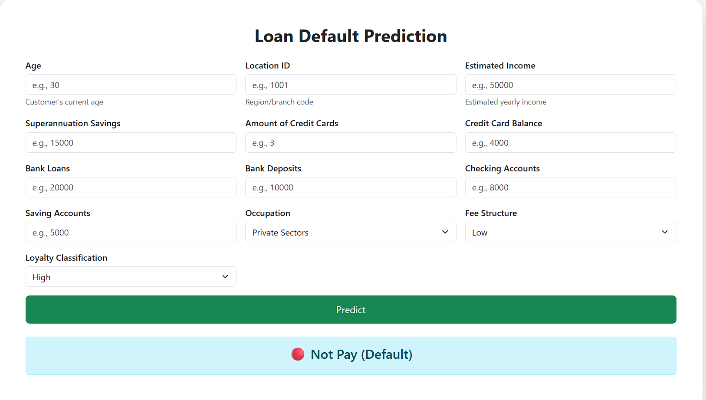

# 🏦 Risk Analytics in Banking and Financial Services

## 📌 Overview

The goal of this project is to develop a foundational understanding of **risk analytics** in the **banking and financial services** domain. The focus is on how data can be effectively leveraged to **minimize the risk of financial loss** while lending money to customers.

Using historical data, we assess **customer profiles** and identify **potential risks** in loan approvals. The final product is a **Flask web application** that allows prediction of whether a loan applicant is **likely to repay or default**.

---

## 🚀 Features

- ✅ End-to-end machine learning pipeline
- 🔍 Exploratory Data Analysis (EDA)
- 📊 Model training and evaluation
- 📦 Model serialized with `.pkl` (joblib or pickle)
- 🌐 Flask-based frontend for user interaction
- 🎨 Clean UI with HTML/CSS

---

## 📁 Project Structure

Risk-Analytics-Banking/
├── app.py # Flask web application
├── Banking- data-analysis.ipynb # Initial EDA and data preprocessing
├── model_improvement.ipynb # Model training, evaluation and saving
├── model/
│ └── model.pkl # Serialized machine learning model
├── templates/
│ └── index.html # Frontend UI
├── static/
│ └── style.css # CSS styling
└── README.md # Project documentation


---

## 🧠 Tech Stack

- **Python**
- **Pandas**, **NumPy**, **Matplotlib**, **Seaborn** – Data Analysis & Visualization
- **Scikit-learn** – Model building
- **Flask** – Web framework
- **HTML/CSS** – Frontend

---

## 🏁 Getting Started

### 1. Clone the Repository

```bash
git clone https://github.com/your-username/risk-analytics-banking.git
cd risk-analytics-banking

pip install -r requirements.txt
python app.py

Data Preprocessing – Null handling, encoding categorical features, feature scaling

Model Building – Trained Logistic Regression / Random Forest / etc. to predict loan repayment

Model Evaluation – Accuracy, Precision, Recall, F1-Score, Confusion Matrix

Deployment – Model is loaded into a Flask app and predictions are served via web UI




---

### ✅ Final Tips:
- Add a `requirements.txt` file if you don’t have one:
```bash
pip freeze > requirements.txt
